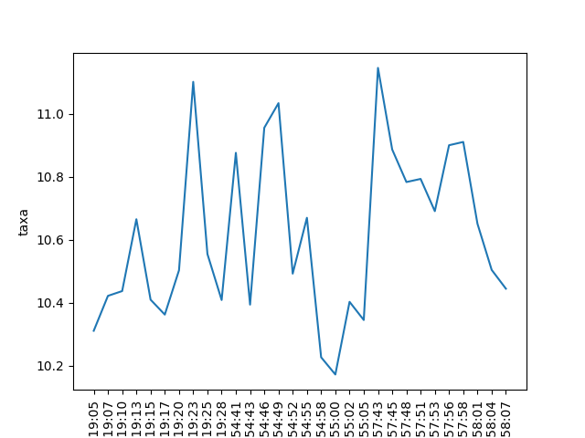

# Gráficos em CDI

Sistema de criação de gráficos do CDI pelo site da B3 e salvando em .png

## Uso

Use o package manager [pip](https://pip.pypa.io/en/stable/) para instalar as biblitecas.

```python
import os
import time
import json
from random import random
from datetime import datetime
import csv
from sys import argv
import pandas as pd
import seaborn as sns
import subprocess

```
Faça a extração e rode:
```python
python analise.py <nome_do_grafico>
```


